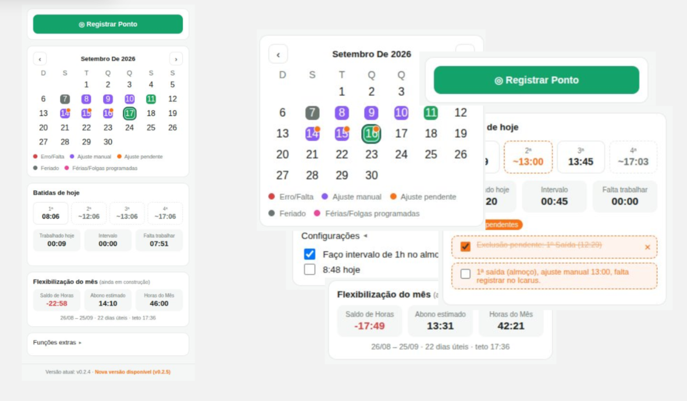

# IcarusWings

[Glossário de UI/UX do painel](https://claude.ai/artifact/SgRp8FNLiHYsce8GjiGkHZ?sk=4h8lWiYWX7Ta9_4Qx3gmgQ)

Extensão de Chrome (painel lateral) que te dá uma visão rápida e prática
do seu ponto no [Ponto Icarus](https://web.pontoicarus.com.br/ponto) —
calendário do mês, batidas do dia, saldo de horas e lembretes — sem
precisar ficar entrando no site toda hora.

## Por que existe

O Icarus não tem uma API pública nem um app com notificações úteis. Esta
extensão resolve isso ficando "por cima" do próprio site: ela não
reimplementa a API dele (não temos acesso a isso, nem deveríamos), ela só
automatiza a interface que você já usa manualmente — de um jeito que
**nunca lê, pede ou armazena seu usuário/senha**.

## O que a extensão faz hoje

- **Calendário do mês**, colorido por dia:
  - 🟢 verde — dia com horas trabalhadas
  - 🔴 vermelho — falta ou inconsistência apontada pelo próprio Icarus
  - 🟣 roxo — dia com ajuste manual ou abono já registrado no Icarus
  - 🟠 ponto laranja no canto — dia com um "ajuste pendente" só da
    extensão (ver abaixo)
- **Painel do dia** (por padrão mostra hoje; clique num dia do calendário
  pra ver os detalhes dele no mesmo lugar, sem popup):
  - as 4 batidas (1ª a 4ª), com asterisco/roxo pra batidas que foram
    ajuste manual no Icarus (mostra o motivo escrito no ajuste)
  - trabalhado / intervalo / falta trabalhar — **ao vivo**, quando é
    hoje: se o turno está aberto (número ímpar de batidas), conta o
    tempo corrido desde a última batida; o intervalo soma só as pausas
    entre batidas (ex.: o almoço), nunca o trecho ainda em aberto
  - previsão de horário de saída (em cinza, "~HH:MM") na 4ª batida,
    enquanto ela ainda não aconteceu de verdade — some assim que a
    batida real (ou pendente) ocupar o lugar
  - tags do dia (falta, inconsistente, ajuste/abono, ajustes pendentes)
  - nota do dia, se houver
- **Registrar Ponto** — clica no ícone real de registrar ponto da tela do
  Icarus (com confirmação antes, já que é uma ação real e irreversível),
  confirma o modal "Deseja realmente efetuar a batida de ponto?" e
  atualiza o painel logo em seguida.
- **Exclusão pendente de batida** — clique numa batida real do cartão pra
  marcar como "pendente de exclusão": ela some do cartão na hora (a
  próxima batida ocupa o lugar dela) e passa a aparecer na lista de
  ajustes pendentes, com um checkbox "já conferi" (só risca o texto, não
  tira da lista) e um botão pra cancelar. Não mexe no Icarus — é só um
  lembrete até você solicitar a exclusão de verdade no site; some de vez
  sozinho quando o gestor aprovar e a batida sumir dos dados do Icarus.
- **Lembretes de bater ponto** (notificação do navegador, mesmo com o
  painel fechado) nos horários padrão 08:00 / 12:00 / 13:00 / 17:00.
  Só aparece se aquela batida ainda não foi feita — se você já bateu
  antes do horário (ex.: voltou do almoço em 30min), o lembrete nem
  aparece.
  - Botão **"Ajustar depois"** na notificação: marca aquele horário como
    pendente (laranja) em vez de te interromper.
- **Horário aproximado de batida faltante** — se uma batida esperada
  está atrasada (ou se você clicar num slot vazio), a extensão te
  pergunta a que horas ela aconteceu de verdade. Ao digitar o horário,
  calcula em tempo real quanto você já trabalhou e quanto ainda falta —
  marcando em laranja no painel/calendário como lembrete visual de que
  ainda falta ajustar aquilo de verdade no Icarus.
- **Confirmações dentro do painel** — registrar ponto, marcar ou cancelar
  uma exclusão pendente etc. abrem um modal no próprio painel, nunca uma
  caixa de diálogo do navegador.
- **Painel nunca abre vazio** — guarda os últimos dados vistos e mostra
  na hora ao reabrir, atualizando por trás assim que a busca real responde.

## Como funciona por baixo (sem tocar em credenciais)

Tentamos, a princípio, fazer a extensão chamar a API do Icarus
diretamente (`fetch`). O Chrome bloqueou — o backend exige um token que o
próprio app do Icarus gerencia sozinho (lido do `localStorage` dele). Ler
esse token nós mesmos seria exatamente o tipo de dado sensível que esta
extensão se recusa a tocar.

Por isso a extensão **aciona os elementos reais da tela** do Icarus
(preenche o período e clica em "Pesquisar", clica em "Notas" e preenche o
formulário, etc.) — é o próprio Icarus que autentica essas ações, com o
token dele. Em paralelo, a extensão só **observa passivamente** as
respostas que o site já recebe, pra extrair os dados pro painel.

Você não precisa abrir/gerenciar essa aba: quando o painel (ou um
lembrete) precisa de dados e não há nenhuma aba do Icarus aberta, a
própria extensão abre uma, fixada e em segundo plano, sem tirar seu foco.

## Como instalar (modo desenvolvedor)

1. Clone este repositório (ou baixe o ZIP e extraia)
2. Abra `chrome://extensions`
3. Ative **"Modo do desenvolvedor"** (canto superior direito)
4. Clique em **"Carregar sem compactação"** e selecione a pasta do
   projeto
5. Abra `https://web.pontoicarus.com.br/ponto` e faça login normalmente
6. Clique no ícone da extensão pra abrir o painel lateral

Na primeira vez, deixe a tela de Registro de Ponto carregar por completo
— é assim que a extensão aprende sua matrícula (`idColaborador`), sem
você digitar nada.

Depois de qualquer atualização de código: recarregue a extensão em
`chrome://extensions` (ícone ⟳) e dê F5 na aba do Icarus.
